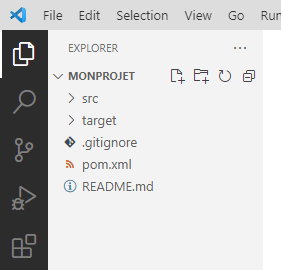
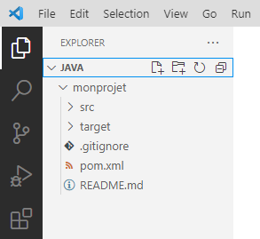
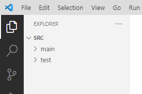
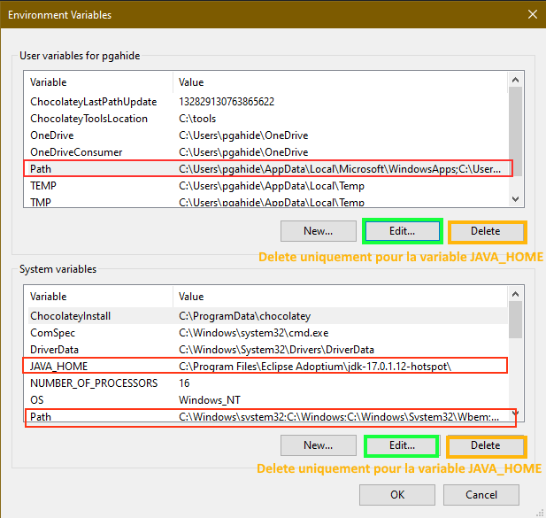

# Mise en place de l'environnement de programmation (Visual Studio Code + Java)

Pour développer en Java, vous aurez besoin de :

- un Environnement de Dévelopement Intégré (IDE) ; nous utiliserons **Visual Studio Code**

- Java Development Kit (JDK)

- ensemble d'outils Java pour l'IDE

La procédure suivante décrit l'installation de ces éléments sur Windows. Si vous utilisez un autre système d'exploitation, vous devrez adapter la procédure en conséquence.

## Visual Studio Code (VS Code)

Nous allons installer un _bundle_ (ensemble logiciel) pour Windows qui comprend tout ce dont on a besoin :

- l'environnement de développement (IDE) Visual Studio Code ;

- le JDK (_Java Development Kit_) pour programmer en Java ;

- les extensions Java pour Visual Studio Code.

Même si vous avez déjà Visual Studio Code installé sur votre machine, vous pouvez utiliser ce _bundle_ d'installation : il n'installera que ce que vous n'avez pas déjà sans affecter votre installation par ailleurs.

Téléchargez et installez l'application suivante :

- [pour Windows](https://aka.ms/vscode-java-installer-win)

- [pour macOS](https://aka.ms/vscode-java-installer-mac)

- pour Linux, il faut faire l'installation « manuellement » (JDK + VS Code + extensions Java pour VS Code) ; si vous êtes déjà utilisateur Linux, on considère que vous savez faire cela tout seul ;) (si problème, demandez de l'aide à l'enseignant)

Vous laisserez toutes les options d'installation par défaut. Pour terminer l'installation, il faut se **déconnecter du système et se reconnecter** (le redémarrage complet de la machine n'est cependant pas nécessaire).

NB : à la première ouverture de VS Code, on vous propose l'installation d'un pack linguistique pour le français. Il est déconseillé d'installer ce pack : l'utilisation d'un IDE en anglais vous apprendra les termes que vous retrouverez plus tard dans la documentation en anglais. Dans le cas général, en informatique, on doit être à l'aise avec la lecture de documentation en anglais et avec les logiciels en anglais, sans traduction automatique. Travailler directement en anglais vous épargnera de nombreux problèmes et vous facilitera globalement votre futur métier.

## Créer un projet Java

Une fois reconnecté, ouvrez VS Code. Nous allons créer un projet Java. Deux procédures sont ici données, avec ou sans Maven. Maven est un outil de gestion de projet et de dépendances très utilisé en Java. Utilisez la procédure 1 (avec Maven) par défaut. Si cela ne fonctionne pas, utilisez la procédure 2 (sans Maven).

### Procédure 1 (avec Maven)

- appuyez sur `F1` (il se peut que vous deviez utiliser conjointement la touche `Fn` de votre ordinateur)

  - ce racourci ouvre la **palette de commande**

  - c'est un outil très utile sous VS Code qui permet d'accéder à toutes les fonctionnalités par simple recherche

  - vous devez donc retenir ce raccourci et ouvrir la palette de commande dès que vous avez besoin de rechercher une fonctionnalité

  - raccourci alternatif : `Ctrl+Shift+P` (la touche `Shift` est également appelée `Maj`, c'est la flèche au-dessus de `Ctrl`)

- tapez `java`

- localisez et lancez `Create Java Project` dans la liste qui s'affiche

- sélectionnez `Maven` (si pas disponible, l'installation n'est pas correcte)

- tapez `junit5` dans le champ de recherche

- aucune proposition correspondante n'apparaît dans la liste, mais cliquez sur `More...`

- sélectionnez `java11-junit5`

- sélectionnez la dernière version disponible

- pour le nom du _package_, la convention généralement utilisée est de mettre le nom de domaine _inversé_ de l'organisation (par exemple : `fr.dampierre`)

- pour l'_artifact_, il s'agit du nom de votre projet (par exemple `introjava`)

- le système ouvre une fenêtre pour vous laisser choisir le répertoire dans lequel sera stocké votre nouveau projet

- parcourez l'arborescence pour localiser votre répertoire de projets Java (par exemple, vous pourriez avoir un répertoire `Java` sur votre bureau Windows)

- **Attention** : ne créez pas un répertoire spécifique pour le nouveau projet (ce sera fait automatiquement) ; indiquez juste votre répertoire de projets Java

- la suite se passe dans le terminal qui s'ouvre dans la partie inférieure de VS Code ; la création de projet est lancée

- la première fois, le gestionnaire de dépendances Maven va faire quelques téléchargements : une connexion internet est donc nécessaire pour cette phase

- au bout d'un moment, le processus va se stopper pour vous laisser indiquer le numéro de version de base de votre programme : laissé le numéro proposé (`1.0-SNAPSHOT`) en appuyant sur `Entrée` (il faudra peut-être donner le focus au terminal en cliquant dessus auparavant)

- confirmez le résumé des informations données avec `Entrée`

- le projet est créé ; cliquez sur `Open` dans la pop-up qui s'ouvre ; VS Code se relance et le nouveau projet est chargé

  - le projet n'est pas créé (mention `BUILD FAILED` dans le terminal) ? Votre installation de Java est incorrecte ; consultez la section « Ça ne fonctionne pas ? » plus bas

- si demandé,indiquez que vous « faites confiance » aux auteurs de des fichiers (il peut être prudent de ne pas « faire confiance » à du code quelconque téléchargé sur Internet : cela vous permettra d'examiner le programme sans pouvoir l'exécuter, car il pourrait contenir du code malicieux)

- laissez toujours quelques secondes à VS Code pour charger le projet en arrière-plan (la pop-up en bas à droite doit se fermer)

- **par la suite, lorsque vous ouvrirez de nouveau un projet existant (`File / Open Folder...`), veillez à toujours bien sélectionner le répertoire contenant le projet, et non pas un répertoire plus haut ou bien un répertoire plus bas** ; vous ne devez pas non plus ouvrir seulement un fichier java avec VS Code : il faut toujours ouvrir le répertoire complet du projet. Il faut toujours qu'un projet Java ouvert indique une architecture de répertoire ressemblant à ceci sur le panneau `Explorer` (cette architecture est celle d'un projet Maven, elle sera légèrement différente si vous utilisez la procédure 2 mais vous aurez toujours le répertoire `src`) :

Notez bien que le répertoire `src`, par exemple, se trouve un niveau au-dessous du projet ouvert. Les deux exemples qui suivent indiquent une ouverture d'un répertoire non-conforme et poseront des problèmes :

- ouverture un cran trop haut :

- ouverture un cran trop bas :

### Procédure 2 (sans Maven)

- appuyez sur `F1` pour ouvrir la **palette de commande**

- tapez `java`

- localisez et lancez `Create Java Project` dans la liste qui s'affiche

- sélectionnez `No Build Tools`

- le système ouvre une fenêtre pour vous laisser choisir le répertoire dans lequel sera stocké votre nouveau projet

- parcourez l'arborescence pour localiser votre répertoire de projets Java (par exemple, vous pourriez avoir un répertoire `Java` sur votre bureau Windows)

- **Attention** : ne créez pas un répertoire spécifique pour le nouveau projet (ce sera fait automatiquement) ; indiquez juste votre répertoire de projets Java

- après avoir sélectionné le répertoire, une nouvelle fenêtre s'ouvre pour vous laisser indiquer le nom du projet ; tapez par exemple `introjava`

- une nouvelle fenêtre VS Code s'ouvre avec votre projet

- si demandé, indiquez que vous « faites confiance » aux auteurs de des fichiers (il peut être prudent de ne pas « faire confiance » à du code quelconque téléchargé sur Internet : cela vous permettra d'examiner le programme sans pouvoir l'exécuter, car il pourrait contenir du code malicieux)

- laissez toujours quelques secondes à VS Code pour charger le projet en arrière-plan (la pop-up en bas à droite doit se fermer)

- **par la suite, lorsque vous ouvrirez de nouveau un projet existant (`File / Open Folder...`), veillez à toujours bien sélectionner le répertoire contenant le projet, et non pas un répertoire plus haut, ou bien un répertoire plus bas** (voir détails dans la procédure 1) ; vous ne devez pas non plus ouvrir seulement un fichier java avec VS Code : il faut toujours ouvrir le répertoire complet du projet 

## Lancement du programme

- Le programme se lance avec l'appui sur la touche `F5` du clavier (il se peut que vous deviez utiliser conjointement la touche `Fn` de votre laptop)

- Au premier lancement, le pare-feu de Windows vous demandera à quels réseaux doit avoir accès VS Code ; cochez les réseaux privés, mais pas les réseaux publics

- Notez que le programme, tel qu'il est construit ici, ne fait absolument rien ; vérifiez juste que, lorsque vous le lancez, aucune erreur ne s'affiche dans le terminal

## Configuration supplémentaire utile

Deux petits paramètres pratiques à activer pour vous permettre d'enregistrer votre code automatiquement et d'avoir toujours un code bien formaté :

- Ouvrez les paramètres VS Code (`Ctrl+,`)

- Recherchez _save_

- Localisez _Auto Save_ et sélectionnez _onFocusChange_ dans la liste déroulante : dorénavant, votre code sera automatiquement sauvegardé dès que la fenêtre d'édition perd le focus (changement de fichier, clic ailleurs...)

- Localisez et cochez *Format on Save* : dorénavant, votre code sera automatiquement formaté (indentation, etc.) à chaque sauvegarde

## Thèmes VS Code

Travailler avec un thème de couleurs qui nous plaît et qui soulage les yeux est important quand on programme.

- `F1` / `Color Theme` vous permet de choisir entre les différents thèmes installés

  - appuyez sur les flèches haut/bas pour naviguer dynamiquement dans la liste des thèmes et voir un aperçu immédiat

  - utilisez le raccourci `Ctrl+K Ctrl+T` pour accéder rapidement à la liste des thèmes

- Vous pouvez ajouter de nouveaux thèmes (clairs ou sombres) via le panneau _Extensions_ (à gauche)

  - tapez `@category:"themes"` dans le champ de recherche pour filtrer sur les thèmes

  - puis cliquez sur les nombreux thèmes proposés pour avoir un aperçu

  - cliquez sur `Install` lorsque vous avez repéré un thème à ajouter

- Il est également possible de _customiser_ d'autres paramètres visuels, comme la police utilisée (dans les paramètres)

  - par défaut, VS Code est paramétré pour utiliser la police `Consolas` ; d'autres polices spécifiques pour le code ont été créées, que vous pouvez tester et installer sur votre système (cherchez `coding fonts` sur votre moteur de recherche préféré)

## Ça ne fonctionne pas ? Résolution des problèmes courants avec Java sous VS Code

- La création de projet (notamment Maven) échoue : vérifiez votre accès Internet

- Vérifiez que vous disposez de la variable d'environnement `JAVA_HOME` qui pointe vers le répertoire du JDK installé (sinon, l'ajouter et déco/reco) ; par exemple, cela pourrait ressembler à : `C:\Program Files\Eclipse Adoptium\jdk-21.0.1.12-hotspot\`

- Vérifiez que votre variable utilisateur `PATH` contient le chemin vers le sous-répertoire `bin` du JDK (sinon, l'ajouter et déco/reco) ; par exemple, cela pourrait ressembler à : `C:\Program Files\Eclipse Adoptium\jdk-21.0.1.12-hotspot\bin` dans la liste des répertoires du `PATH`

- Vérifiez que vous n'avez pas d'anciens `JAVA_HOME` ou des répertoires dans les variables `PATH` qui pointeraient vers des répertoires inexistants ou d'anciens JDK, supposés désinstallés ; normalement, vous devriez avoir :

  - une variable `JAVA_HOME` dans les variables d'environnement utilisateur (ou bien système)

  - le répertoire pointant vers votre JDK fraîchement installé dans la variable d'environnement utilisateur `PATH` (ou bien système)

- N'oubliez pas de vous déconnecter/reconnecter après chaque modification

- Avez-vous ouvert le bon répertoire de projet comme spécifié à la fin de la procédure 1 ? Regardez bien quel niveau est ouvert, et vérifiez que vous n'avez pas juste ouver un fichier Java seul

- Le programme ne se lance pas :

  - avez-vous des erreurs de compilation (soulignées en rouge dans le code) ? Il faut les corriger.

  - avez-vous bien ouvert le bon répertoire de projet comme spécifié ci-dessus ? Regardez bien quel niveau est ouvert.

  - essayez `F1` / `Java: Force Java Compilation` (indiquez `Full` ensuite)

  - essayez de relancer VS Code (`F1` / `Reload Window`) ; parfois, cela résout le problème tout seul

  - avez-vous les variables d'environnement `JAVA_HOME` et `PATH` correctement spécifiées (voir ci-dessus) ?

- Pour les erreurs ci-dessous, faites : `F1` / `Clean Java Language Server Wokspace` puis redémarrez VS Code comme proposé (_Restart and delete_)

  - les erreurs de code ne sont pas soulignées ;

  - au contraire il trouve des erreurs là où il n'y en a pas ;

  - au lancement, il vous dit : `Could not find or load main class` ;

  - potentiellement à essayer pour d'autres problèmes inexpliqués (ça ne peut pas faire de mal de toute façon)

- Les erreurs persistent ? Utilisons les fichiers de _logs_ pour en savoir plus :

  - dans les paramètres, recherchez `java.trace.server` et positionnez l'option sur `verbose`

  - puis, si c'est l'extension Java qui ne se lance pas correctement, examinez les logs `vscode-java` :

    - `F1` / `Toggle Developer Tools`

    - Ouvrez le panneau `Console` dans la fenêtre qui s'affiche

  - vous pouvez aussi examiner les logs du serveur de langage Java et les logs de l'extension Java, cela peut vous donner des indices supplémentaires :

    - `F1` / `Java: Open Java Language Server log file`

    - `F1` / `Java: Open Java Extension log file`

## Gros problèmes ? Réinstallation propre du JDK

Une solution radicale en cas de problème persistant est de supprimer tous les JDK installés et de repartir sur une installation propre.

### Désinstallation des JDK

- rendez-vous dans les paramètres de Windows

- _Applications_

- recherchez « jdk » dans la liste de programmes installés

- supprimez tous les JDK trouvés

### Suppression des entrées dans les variables d'environnement

La variable d'environnement `PATH` sur votre système contient un ensemble de répertoires qui sont parcourus lorsque le système tente de localiser un programme. Il se peut que les JDK désinstallés aient posé des entrées dans cette variable `PATH` qui n'ont pas été supprimées. Il est important de les supprimer pour éviter tout problème d'incompatibilité par la suite. Il est tout à fait possible et même probable que vous ne trouviez rien à supprimer du tout. Il faut quand même vérifier :

- rendez-vous dans les paramètres de Windows

- dans la recherche de paramètres, tapez « environ », localisez et ouvrez la fenêtre de consultation des _variables d'environnement_

- dans la liste des entrées « *variables utilisateur* » :

  - **ATTENTION : dans ce qui suit, ne supprimez surtout pas l'ensemble de la variable PATH**

  - localisez la variable `PATH` (si elle existe)

  - modifiez-la (bouton) ; une liste de chemin s'affiche

  - vérifiez dans la liste des chemins si certains contiennent une référence à un JDK (ils contiendront la chaîne de caractères « jdk »)

  - supprimez-les tous le cas échéant

- toujours dans la liste des entrées « variables utilisateur » :

  - localisez la variable `JAVA_HOME` (si elle existe)

  - supprimez la variable complètement

- dans la liste des entrées « *variables système* » :

  - répétez le processus précédent pour les chemins contenus dans la variable `PATH`

  - répétez le processus précédent pour la variable `JAVA_HOME` (si elle existe)

Par exemple, sur le système suivant, ces trois entrées doivent être considérées et modifiées avant installation :

Le système est maintenant prêt à accueillir un nouveau JDK. Relancez le programme d'installation téléchargé précédemment. Le programme va réinstaller un JDK et configurer les variables d'environnement correctement.
